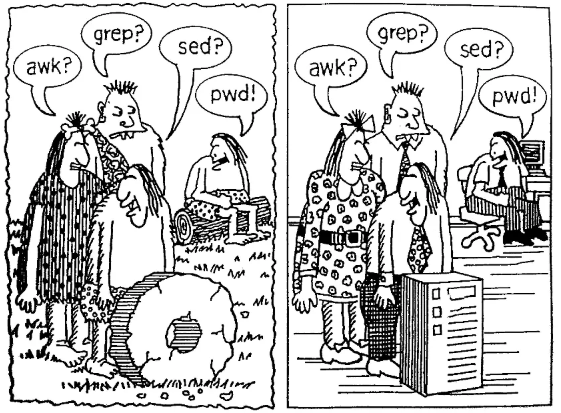
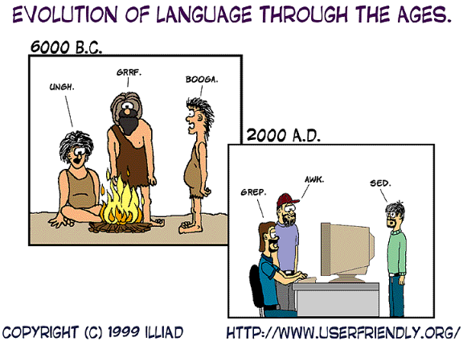
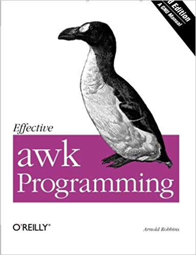
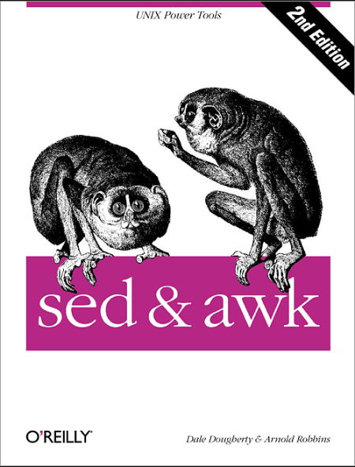

# awk 基本功（Learn awk）



<font size=5> 上古神器；文本处理三剑客；文本格式化工具；报告生成器</font>




## 本仓库内容

1. awk基本功学习笔记

* GitBook:<https://yifengyou.gitbooks.io/learn-awk/content/>
* GitHub:<https://github.com/yifengyou/learn-awk/>
* GitPage:<https://yifengyou.github.io/learn-awk/>

```
Something I hope you know before go into the coding~
First, please watch or star this repo, I'll be more happy if you follow me.
Bug report, questions and discussion are welcome, you can post an issue or pull a request.
```


## 目录


## 参考





* Awk Tutorial : <https://www.tutorialspoint.com/awk/index.htm>


## 小结
